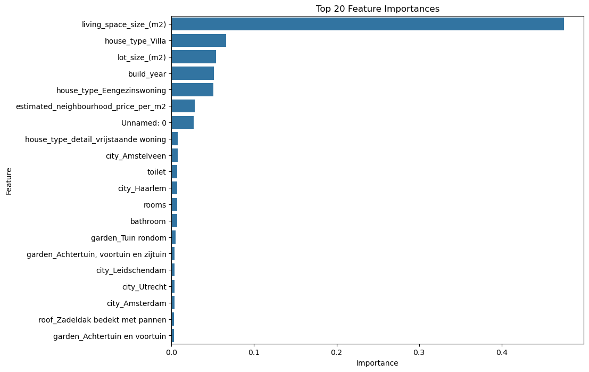
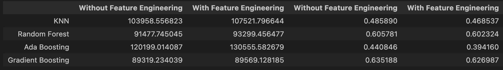
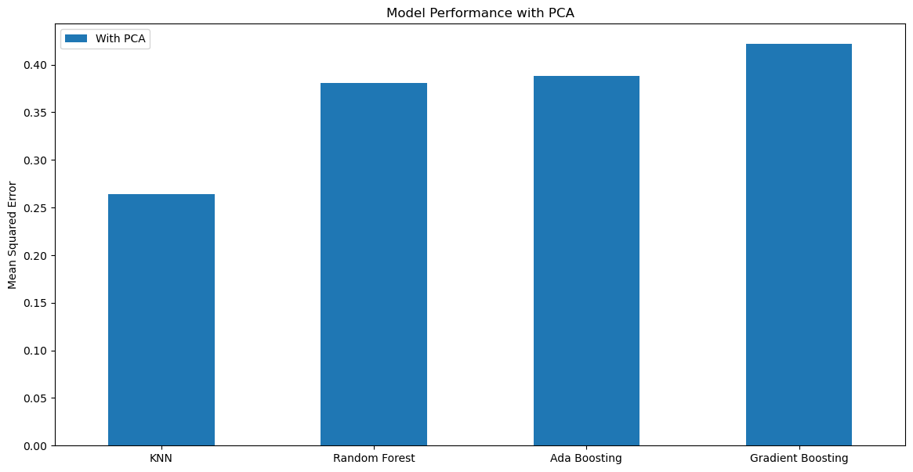
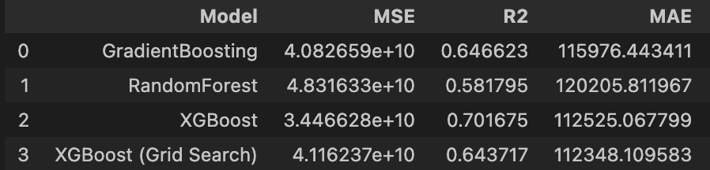

# Dutch House Price Project

## Project Overview

This project focuses on predicting real estate prices in The Netherlands using machine learning techniques to support stakeholders such as real estate agents, buyers, and investors. The primary objective is to develop and optimize models that can accurately forecast property values by leveraging a diverse set of features, including both numerical and categorical data.   
Our approaches involve exploring various machine learning algorithms and evaluating their performance to determine the most effective model for price prediction. By providing reliable predictions, we aim to enable informed decision-making in the real estate market. This repository contains all relevant code, data, and documentation for replicating and understanding our predictive modeling process.

## Data
Data source: [Data source](https://www.kaggle.com/datasets/bryan2k19/dutch-house-prices-dataset) 

The data consists of information retrieved from the largest real estate website in the Netherlands until 2022: [Funda](https://www.funda.nl/en/). The detail of the data can be found in the metadata.

### Metadata
- address : the address of the house.
- city : the city where the house is located.
- price : price of the house.
- lot_size_(m2) : the area of land on which the house is located.
- living_space_size_(m2) : the area of the house. 
- build_year : year when the house built.
- house_type : type of the house.
- roof : type of the house's roof. 
- rooms : total rooms in the house, which consist of a living room and bedroom(s).
- toilet : total toilet(s) and bathroom(s) in the house.
- floors : total floor(s) that the house has.
- energy_label : shows how energy-efficient the house is. Houses with an A-label are the most energy-efficient, while houses with a G-label are the least energy efficient.
- position : location of the house, for example, in the middle of city or on a quiet road and in a residential area.
- garden : types of garden that the house has, for example, front yard, back yard, or side garden.
- estimated_neighbourhood_price_per_m2 : estimated price/m2 of the neighbourhood of the house. 

## Exploratory Data Analysis
The figures below show the correlation between numerical columns and also correlation columns.

## Machine Learning models
### **1. Numerical columns**
In this approach, we focused solely on numerical variables and compared the impact of different outlier handling techniques, specifically Z-score and IQR.

Random Forest emerged as the best model with an R² of 0.51.

The table below provides comparison of mean squared error, root mean squared error, mean absolute error, and R-squared score of each model where we remove the outliers with Z-score and IQR, respectively.

- Z-score  

- IQR  

### **2. Numerical and Categorical columns**

#### 2.1. With/Without Feature Engineering
In this approach, we incorporated both numerical and categorical variables and evaluated the models with and without feature engineering.

Gradient Boosting, without feature engineering, achieved the highest R² of 0.64.

#### 2.2 With PCA and IQR (outliers)
This approach focused on enhancing the predictive power by applying feature engineering techniques, such as PCA, to both numerical and categorical variables.

The Gradient Boosting model, after applying PCA, achieved an R² of 0.42.

#### 2.3. Apply PCA and Without Feature Engineering
To enhance the predictive accuracy of our models, we apply Principal Component Analysis (PCA) to reduce dimensionality and improve model performance. Our approach focuses on using raw features without additional feature engineering. 

For hyperparameter tuning, we employ Grid Search to systematically explore and optimize model parameters. Additionally, we use k-Fold Cross-Validation to ensure robust and reliable evaluation of model performance.

## Key Findings and Insights

- **Outlier Removal**: Using z-score for outlier removal significantly improves model performance by reducing the impact of extreme values on predictions.
  
- **Best Model**: The XGBoost model emerged as the most effective for predicting house prices in this dataset, achieving an R² value of 0.70. However, it has a higher Mean Absolute Error (MAE) of €112,525 compared to the Gradient Boosting model used in section 2.1.
  
- **Model Performance**: The R² value of 0.70 for the XGBoost model suggests a strong correlation between predicted and actual house prices, indicating that the model provides a good fit for the data and is effective at predicting future outcomes.

## Additional links:
- [Kanban](https://trello.com/b/VaFoOuYu/kanban-machine-learning)
- [Presentation](https://docs.google.com/presentation/d/1qfcNhSIu0wK0np3_r0tG_urZ6TMGynuDCCXd9tZdQSM/edit?pli=1#slide=id.g10facb75130_0_1464)
